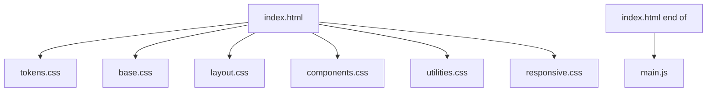

# Design Document: Frontend Decoupling

## Overview

This design describes the extraction of all inline CSS (~900 lines) and
JavaScript (~50 lines) from `index.html` into external files under `assets/css/`
and `assets/js/`. The CSS will be organized using a layered methodology inspired
by ITCSS (Inverted Triangle CSS), splitting styles into logical files ordered by
specificity. The JavaScript will be extracted into a single file since the
codebase is small (~50 lines covering four behaviors). The result is a
maintainable, cacheable, lintable static site with zero build requirements.

### Key Design Decisions

1. **ITCSS-inspired layered CSS** over a single monolithic file — provides clear
   file boundaries by specificity layer, making it predictable where to add new
   styles. The layers are: tokens/variables → reset/base → layout → components →
   utilities.
2. **Single JS file** rather than per-feature modules — the JS is only ~50 lines
   covering 4 simple behaviors (navbar scroll, mobile toggle, scroll reveal,
   smooth scroll). Splitting into multiple files would add HTTP requests with no
   maintainability benefit at this scale.
3. **No build process** — all files are standard CSS and ES2021+ JS, served
   directly. No preprocessors, bundlers, or transpilers required.
4. **Render-blocking CSS in `<head>`** — all stylesheets loaded via `<link>`
   tags in the `<head>` to prevent FOUC. The `<script>` tag placed at the end of
   `<body>` with `defer` is unnecessary since it's already at the bottom, but we
   keep it simple.

## Architecture

### File Loading Strategy



All CSS files are loaded as render-blocking `<link>` elements in the `<head>`,
in cascade order. The JS file is loaded via a `<script>` tag at the end of
`<body>` (before the closing `</body>` tag), preserving the current behavior
where DOM is fully parsed before script execution.

### CSS Cascade Order

The loading order is critical for correct specificity:

1. **tokens.css** — CSS custom properties (`:root` variables) — no selectors,
   just design tokens
2. **base.css** — Reset, `html`, `body`, and element-level typography styles
3. **layout.css** — Structural layout: `.container`, `.section-padding`, grid
   systems, nav positioning
4. **components.css** — All component styles: hero, about, purpose, companies,
   contact, footer, buttons, forms, cards
5. **utilities.css** — Animation keyframes, scroll-reveal classes, delay
   utilities
6. **responsive.css** — All media queries consolidated in one file, ordered by
   breakpoint (1024px → 768px → 480px)

### JavaScript Architecture

Single file `assets/js/main.js` containing:

- Navbar scroll effect (IntersectionObserver or scroll listener)
- Mobile menu toggle
- Scroll reveal via IntersectionObserver
- Smooth anchor scrolling

All code wrapped in a `DOMContentLoaded` listener or placed at end of `<body>`
(current pattern).

## Components and Interfaces

### CSS File Breakdown

| File                        | Contents                                                                                                                                                                                            | Approx. Lines |
| --------------------------- | --------------------------------------------------------------------------------------------------------------------------------------------------------------------------------------------------- | ------------- |
| `assets/css/tokens.css`     | `:root` custom properties (colors, typography tokens)                                                                                                                                               | ~30           |
| `assets/css/base.css`       | Reset (`*`, `*::before`, `*::after`), `html`, `body`, `.heading-display`, `.heading-sans`                                                                                                           | ~30           |
| `assets/css/layout.css`     | `nav`, `.nav-*`, `.container`, `.section-padding`, `.section-label`, `.section-title`, `.section-divider`, grid structures (`.about-grid`, `.contact-grid`, `.companies-grid`, `.companies-bottom`) | ~200          |
| `assets/css/components.css` | `.hero-*`, `.about-*`, `.purpose-*`, `.company-card`, `.card-*`, `.contact-*`, `.form-*`, `.btn-*`, `.social-*`, `footer`                                                                           | ~500          |
| `assets/css/utilities.css`  | `.reveal`, `.reveal.visible`, `.reveal-delay-*`, `@keyframes fadeUp`, `@keyframes float`, `@keyframes scrollPulse`                                                                                  | ~50           |
| `assets/css/responsive.css` | All `@media` queries for 1024px, 768px, 480px breakpoints                                                                                                                                           | ~80           |

### JavaScript File

| File                | Contents                                                                                                                          |
| ------------------- | --------------------------------------------------------------------------------------------------------------------------------- |
| `assets/js/main.js` | Navbar scroll class toggle, mobile menu toggle + close on link click, IntersectionObserver scroll reveal, smooth anchor scrolling |

### HTML Interface Changes

The `index.html` `<head>` will gain six `<link>` tags replacing the single
`<style>` block:

```html
<link rel="stylesheet" href="assets/css/tokens.css" />
<link rel="stylesheet" href="assets/css/base.css" />
<link rel="stylesheet" href="assets/css/layout.css" />
<link rel="stylesheet" href="assets/css/components.css" />
<link rel="stylesheet" href="assets/css/utilities.css" />
<link rel="stylesheet" href="assets/css/responsive.css" />
```

The `<script>` block at the end of `<body>` will be replaced with:

```html
<script src="assets/js/main.js"></script>
```

## Data Models

This feature does not introduce new data models. The existing DOM structure, CSS
custom properties, and JavaScript DOM references remain unchanged.

### CSS Custom Properties (Design Tokens)

These are the existing tokens that will be preserved in `tokens.css`:

| Token              | Value                       | Purpose                     |
| ------------------ | --------------------------- | --------------------------- |
| `--copper`         | `#b87333`                   | Primary brand color         |
| `--copper-light`   | `#d4956a`                   | Lighter copper accent       |
| `--steel`          | `#8a9bae`                   | Secondary brand color       |
| `--steel-light`    | `#b0bec5`                   | Lighter steel accent        |
| `--charcoal`       | `#121217`                   | Dark background             |
| `--charcoal-light` | `#1a1a22`                   | Slightly lighter background |
| `--surface`        | `#15151d`                   | Card/component surface      |
| `--surface-hover`  | `#1e1e28`                   | Hover state surface         |
| `--text-primary`   | `#eae7e2`                   | Primary text color          |
| `--text-secondary` | `#9a978f`                   | Secondary text color        |
| `--text-muted`     | `#6b6860`                   | Muted/subtle text           |
| `--border`         | `rgba(184, 115, 51, 0.15)`  | Border color                |
| `--glow-copper`    | `rgba(184, 115, 51, 0.25)`  | Copper glow effect          |
| `--glow-steel`     | `rgba(138, 155, 174, 0.15)` | Steel glow effect           |

### JavaScript DOM References

| ID/Selector     | Usage                           |
| --------------- | ------------------------------- |
| `#navbar`       | Scroll class toggle             |
| `#mobileToggle` | Mobile menu button              |
| `#navLinks`     | Navigation links container      |
| `.reveal`       | Scroll reveal animation targets |
| `a[href^="#"]`  | Smooth scroll anchor links      |

## Correctness Properties

_A property is a characteristic or behavior that should hold true across all
valid executions of a system — essentially, a formal statement about what the
system should do. Properties serve as the bridge between human-readable
specifications and machine-verifiable correctness guarantees._

### Property 1: BEM-like class naming consistency

_For any_ CSS class selector in the external stylesheets, the class name should
match the kebab-case BEM-like pattern (e.g., `block-name`,
`block-name__element`, `block-name--modifier`) — specifically the regex
`^[a-z][a-z0-9]*(-[a-z0-9]+)*(__[a-z0-9]+(-[a-z0-9]+)*)?(--[a-z0-9]+(-[a-z0-9]+)*)?$`.

**Validates: Requirements 3.3**

### Property 2: Consistent media query breakpoint direction

_For any_ `@media` rule in the external stylesheets, the media query should use
`max-width` consistently (preserving the existing desktop-first pattern), and
the breakpoint values should be one of the defined set: `1024px`, `768px`,
`480px`.

**Validates: Requirements 4.6**

### Property 3: Interactive element state preservation

_For any_ interactive element selector (`a`, `button`, `input`, `textarea`) that
has a `:hover` or `:focus` pseudo-class rule in the original inline CSS, the
external stylesheets should also contain a corresponding `:hover` or `:focus`
rule for that same selector.

**Validates: Requirements 5.4**

### Property 4: No preprocessor syntax in CSS files

_For any_ CSS file in `assets/css/`, the file content should not contain
preprocessor-specific syntax patterns such as Sass `$variable` declarations,
`@mixin`, `@include`, `@extend` (Sass), Less `.mixin()` calls, or Stylus
indentation-based syntax. All files should be valid standard CSS.

**Validates: Requirements 6.2**

### Property 5: Standard script-mode JavaScript

_For any_ JavaScript file in `assets/js/`, the file should not contain ES module
syntax (`import`/`export` statements) or TypeScript-specific syntax (type
annotations, interfaces, enums), ensuring it can be loaded as a classic script
without a bundler or transpiler.

**Validates: Requirements 6.3**

## Error Handling

### CSS Loading Failures

- If any external stylesheet fails to load (e.g., 404), the page will render
  with partial or no styles. This is the same risk as any external CSS approach.
- Mitigation: All CSS files are served from the same origin (`assets/css/`),
  minimizing network failure risk. The cascade order ensures that even if a
  later file fails, base styles still apply.

### JavaScript Loading Failures

- If `main.js` fails to load, the page content remains fully visible and
  readable — all interactive enhancements (scroll effects, mobile menu, reveal
  animations) degrade gracefully since they are progressive enhancements.
- The mobile menu will not toggle, but the desktop navigation links remain
  visible on larger viewports.

### Browser Compatibility

- CSS custom properties are supported in all modern browsers (Chrome 49+,
  Firefox 31+, Safari 9.1+, Edge 15+). No fallback needed per the requirements
  targeting last 2 versions.
- IntersectionObserver is supported in all modern browsers. No polyfill needed.

### File Path Errors

- All file paths are relative (`assets/css/...`, `assets/js/...`), ensuring the
  site works when served from any directory or domain.
- The `.gitkeep` files in `assets/css/` and `assets/js/` should be removed once
  real files are added.

## Testing Strategy

### Dual Testing Approach

This feature requires both unit/example tests and property-based tests for
comprehensive coverage.

### Unit / Example Tests

These verify specific structural expectations:

1. **External file linking** — Verify `index.html` contains `<link>` tags
   pointing to `assets/css/*.css` and a `<script>` tag pointing to
   `assets/js/main.js` (validates 1.1, 2.1)
2. **Zero inline code** — Verify `index.html` contains zero `<style>` tags and
   zero inline `<script>` tags (validates 1.2, 2.2)
3. **CSS methodology file structure** — Verify `assets/css/` contains the
   expected files: `tokens.css`, `base.css`, `layout.css`, `components.css`,
   `utilities.css`, `responsive.css` (validates 3.1)
4. **Design tokens in dedicated file** — Verify `tokens.css` contains all 14 CSS
   custom properties and that `:root` declarations only appear in `tokens.css`
   (validates 3.2)
5. **Cascade order** — Verify the `<link>` tags in `index.html` appear in the
   correct order: tokens → base → layout → components → utilities → responsive
   (validates 3.5)
6. **Breakpoint coverage** — Verify `responsive.css` contains `@media` rules for
   1024px, 768px, and 480px (validates 4.1)
7. **Semantic HTML preserved** — Verify `index.html` retains `nav`, `section`,
   `footer`, `form`, `label`, `button` elements and all `aria-label` attributes
   (validates 5.1, 5.2)
8. **CSS in head, scripts after** — Verify all `<link rel="stylesheet">` tags
   are in `<head>` and all `<script src>` tags are after them (validates 7.1,
   7.2)
9. **Lint-staged glob coverage** — Verify `package.json` lint-staged config
   globs match `*.css` and `*.js` files (validates 8.4)
10. **Linting passes** — Run `npm run lint:css` and `npm run lint:js` and verify
    zero errors (validates 1.4, 2.4, 8.1, 8.2)
11. **Formatting passes** — Run `npm run format:check` and verify zero errors
    (validates 1.5, 2.5, 8.3)

### Property-Based Tests

Property-based testing library: **fast-check** (JavaScript)

Each property test should run a minimum of 100 iterations and be tagged with a
comment referencing the design property.

- **Property 1: BEM-like class naming** — Generate random CSS class selectors
  extracted from all external stylesheets and verify each matches the BEM-like
  kebab-case pattern. Tag:
  `Feature: frontend-decoupling, Property 1: BEM-like class naming consistency`

- **Property 2: Media query direction** — Generate/extract all `@media` rules
  from external stylesheets and verify each uses `max-width` with a value from
  the allowed breakpoint set. Tag:
  `Feature: frontend-decoupling, Property 2: Consistent media query breakpoint direction`

- **Property 3: Interactive state preservation** — For each interactive element
  hover/focus rule found in the original inline CSS, verify the external
  stylesheets contain a matching rule. Tag:
  `Feature: frontend-decoupling, Property 3: Interactive element state preservation`

- **Property 4: No preprocessor syntax** — For each CSS file, scan content for
  preprocessor-specific patterns and verify none are found. Tag:
  `Feature: frontend-decoupling, Property 4: No preprocessor syntax in CSS files`

- **Property 5: Standard script-mode JS** — For each JS file, verify no
  `import`/`export` statements or TypeScript syntax are present. Tag:
  `Feature: frontend-decoupling, Property 5: Standard script-mode JavaScript`
